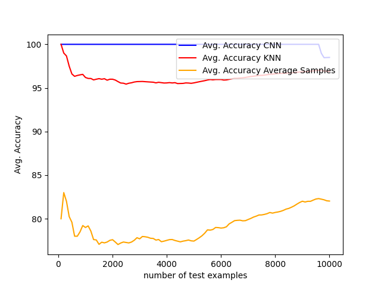

# Machine learning for beginners with MNIST data (Pytorch)
To clone this responsibility, run  
`$user git clone https://github.com/huynhtuan17ti/MNIST`  
To install all required python library for this project, run  
`$user pip install -r requirements.txt`  

To retrain CNN model, run  
`$user python train.py --batch_size 150 --lr 0.001 --epochs 6 --log_interval 90 --save True`  
`$user python train.py -h` for more details  

To predict on test set (10000 images) on CNN model and KNN model, run  
`$user python inference.py --n_neighbors 1 --arith_ratio 100`  
`$user python inference.py -h` for more details  

An inference result:  

